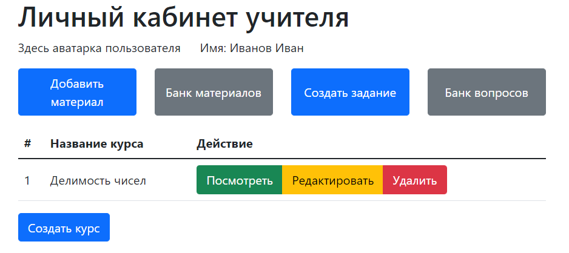
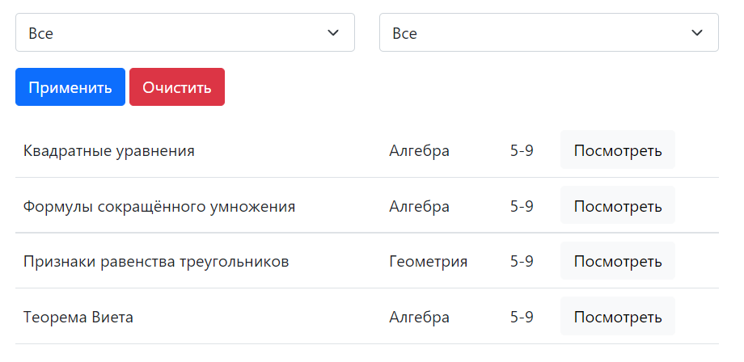

#Проект Шпиль

###Сайт даёт возможность учителям и ученикам размещать и просматривать материалы, задания и тесты.

####Пользователи делятся на три категории:
* Администратор
  * Помещает сайт на сервер
  * Добавляет на платформу аккаунты других пользователей
   
 
* Учитель
  * Загружает материалы и задания по предмету
  * Создаёт курсы
  * В личном кабинете отображаются добавленне ранее материалы и задания
    
    
   
 
* Ученик
  * Загружает материалы
  * Обучается на курсах
    
    
    
####Основные страницы:
  
* Банк материалов отображает все заруженные на сайт материалы, аналогично банк вопросов даёт возможность пользователя прорешать добавленные на сайт вопросы и задания

 

* Страница с добавлением материалов позволяет пользователю загружать файлы на платформу, присваивая им необходимые характеристики

 

* Создание вопросов - пользоваетель вводит текст вопроса и возможные варианты ответа, предварительно введя их количество

 

  